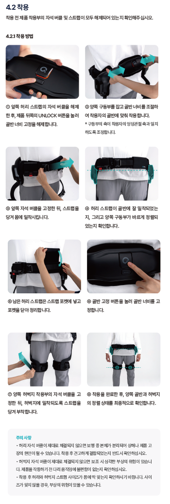

# 엔젤슈트 H10 챗봇



## 프로젝트 소개
엔젤슈트 H10 제품 정보를 제공하는 웹 기반 챗봇입니다. 사용자가 제품에 대해 질문하면 관련 정보를 텍스트와 이미지로 제공합니다.

## 기능
- 💬 제품 정보 질의응답: 기본 정보, 제품 구성, 착용 방법 등 제공
- 🖼️ 이미지 지원: 착용 방법, 배터리 충전 등 시각적 정보 제공
- 📚 PDF 매뉴얼 다운로드 기능
- 🎬 YouTube 동영상 연결 (착용 방법)
- 📱 반응형 디자인: 모바일 및 데스크톱 환경 지원

## 데모


## 설치 및 실행 방법
1. 저장소 클론
```bash
git clone https://github.com/yourusername/angelsuit-h10-chatbot.git
cd angelsuit-h10-chatbot
```

2. 웹 서버 실행
```bash
python -m http.server 8080
```

3. 브라우저에서 접속
```
http://localhost:8080/index.html
```

## 기술 스택
- HTML5
- CSS3
- JavaScript (ES6+)
- 외부 라이브러리:
  - Google Material Icons
  - Pretendard 웹 폰트

## 사용 예시
- "엔젤슈트 H10은 어떤 제품인가요?" - 제품 기본 정보 확인
- "착용 방법은 어떻게 되나요?" - 이미지와 동영상 링크로 착용 방법 확인
- "사용설명서 다운로드" - PDF 매뉴얼 다운로드
- "구성품은 무엇인가요?" - 제품 구성품 목록 확인

## 라이센스
MIT License

## 개발자 정보
© 2025 엔젤슈트 H10 챗봇

*참고: 이 챗봇에 포함된 제품 정보는 데모용이며 실제 제품과 다를 수 있습니다.* 